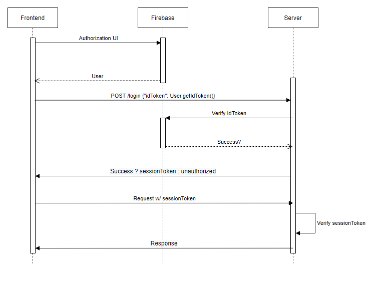

# Authentication

Authentication will be achieved through Firebase APIs to make user management effortless. The frontend authenticates through Firebase directly using the [Authentication API](https://firebase.google.com/docs/auth) and requests data from the backend server by attaching the returned `IdToken` to the headers of a request. The server then verifies the `IdToken` through the [Admin Auth API](https://firebase.google.com/docs/auth/admin). The frontend requests would then attach `SessionToken` so the server can verify each request.

# Game Notes

The objects that make up the game and their behavior

## Objects
- Country
- Province
- 34 of the land provinces have supply centers
- Each player starts with 3 supply center provinces, Russia 4 (Home Supply Centers)
- Army
- Fleet

## Movements
- Hold
- Move
- Support
- Convoy

## Phases
- Beginning year is 1901
- A year is broken up into a Spring and Fall season
- Each season is broken up into four phases:
    - Negotiation: Very first negotiation phase lasts 30 minutes, the rest last 15 minutes. Facilitated by built-in chat feature with   private DMs between countries.
    - Post-negotiation: Players write down movements
    - Movement/order resolution: Movements are executed simultaneously, various conditional rules applied
    - Retreating and disbanding: In battles that are not a stalemate, the losing player may either retreat to an open and adjacent province or disband their unit if they are either unwilling to retreat or there are no provinces to retreat to.
- End of year
    - After each Fall move, newly acquired supply centers become owned by the occupying player, and each power's supply center total is recalculated; players with fewer supply centers than units on the board must disband units, while players with more supply centers than units on the board are entitled to build units in their Home centers (supply centers controlled at the start of the game). Players controlling no supply centers are eliminated from the game, and if a player controls 18 or more (that is, more than half) of the 34 supply centers, that person is declared the winner. Players who remain may also agree to a draw – around half of all games will end in a draw. [Wikipedia](https://en.wikipedia.org/wiki/Diplomacy_(game)#Gameplay)

## Design Ideas
 - The shorthand would not be hard to parse, taking some pressure off frontend team.
 
## Provinces 

### Controlled by country at start
F = Fleet	A = Army
- Germany
    - F - Ank
    - A - Con
    - A - Smy
- England
    - F - Lon
    - F - Edi
    - A - Lvp
- France
    - A - Par
    - A - Mar
    - F - Bre
- Italy
    - A - Rom
    - A - Ven
    - F - Nap
- Austr- 
    - A - Vie
    - A - Bud
    - F - Tri 
- Turkey
    - F - Ank
    - A - Con
    - A - Smy
- Russia
    - A - Mos
    - F - Sev
    - A - War
    - F - Stp

### Uncontrolled Provinces
- Bel
- Bul
- Den
- Gre
- Hol
- Nwy
- Por
- Rum
- Ser
- Spa
- Swe
- Tun
